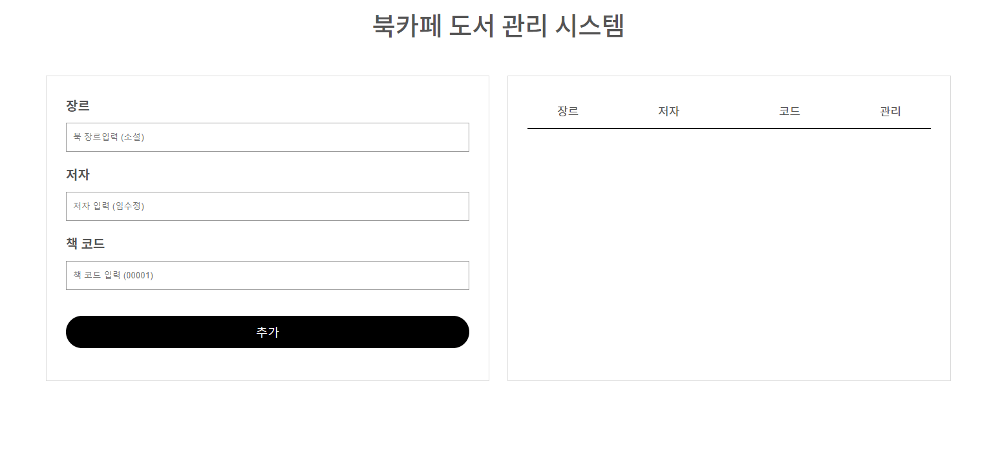
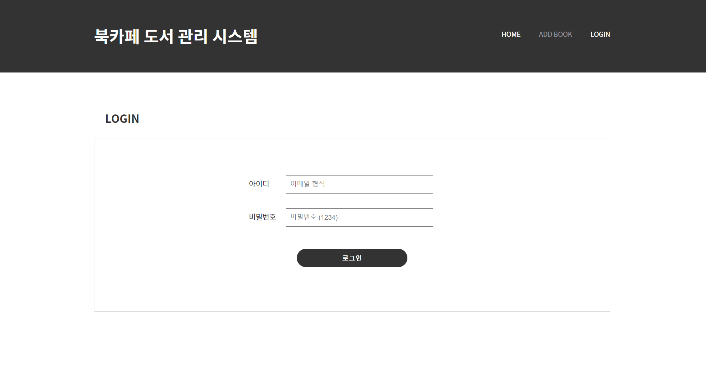
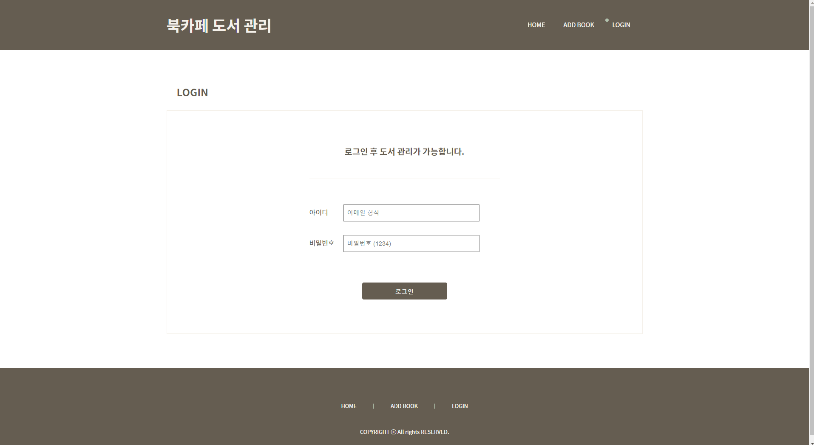

# 도서관리 프로그램

도서관에서 사용할 수 있는 도서관리 기능을 구현
<br>도서목록에 책 추가, 수정, 삭제
<br>localStorage를 이용한 로그인기능


---
- Version1. JavaScript + css : https://hajinkimm.github.io/LibraryManagement/LibraryManagement_js/
- Version2. React + sass : https://hajinkimm.github.io/LibraryManagement/LibraryManagement_react/dist/
- Version3. React_Context : https://hajinkimm.github.io/LibraryManagement/LibraryManagement_react_context/dist/
- Version4. React_Redux : https://hajinkimm.github.io/LibraryManagement/LibraryManagement_react_redux/dist/
---
# Version 1

## 1.1 구조
- 파일구조

    

---
## 1.2 화면 출력
- 결과물

    

---
## 1.3 code 설명
- data 추가
    ```js
    const onSubmit=(e)=>{
        e.preventDefault()
        if(!title || !author || !bookcode) return
        if(isEdit){
            setIsEdit(false)
            setData(data.map(item=>item.id===user.id?user:item))
            setIsMsg(true)
            setMsg('도서가 수정 되었습니다.')
        }else{
            user.id = no.current++
            setData([...data, user])
            setIsMsg(true)
            setMsg('도서가 추가 되었습니다.')
        }
        setUser({title:'', author:'', bookcode:''})
        textRef.current.focus()
    }
    ```

- data 수정
    ```js
    const onEdit =(id)=>{
        setIsEdit(true)
        setUser(data.find(item=>item.id===id))
    }
    ```
- data 삭제
    ```js
    const onDel=(id)=>{
        setData(data.filter(item=>item.id !== id))
        setIsMsg(true)
        setMsg('도서가 삭제 되었습니다.')
    }
    ```
- localStorage를 이용하여 data저장
    ```js
    useEffect(()=>{
        localStorage.setItem('data',JSON.stringify(data))
    },[data])
    ```
- 추가, 삭제, 수정 시 메세지 출력
    ```js
    useEffect(()=>{
        const timer = setTimeout(()=>{
            setIsMsg(false)
        },1000)
        return()=>{
            clearTimeout(timer)
        }
    },[isMsg])
    ```
---
# Version2
- version1을 React + sass로 리팩토링

---
# Version3
- version2를 React Context로 리팩토링
- localStorage를 이용한 로그인기능 구현
- 로그인 후에만 도서목록 확인가능
## 3.1 화면출력
- 로그인 시에만 도서목록확인 및 도서추가가 가능하도록 구현

  
## 3.2 code 추가
  - 비밀번호는 임의로 1234로 지정하였으며 1234를 입력했을 경우에만 로그인 가능 및 id만 localStorage에 저장
  <br> ( 로그아웃 시 localStorage안에 id 삭제 )
    -  아이디: 이메일 형식으로 작성
    - 비밀번호 : 1234

    ```js
    const login = (email, password)=>{
        const loguser = {
            id : 'a1234',
            email
        }
        localStorage.setItem('user', JSON.stringify(loguser))
        if(password==='1234'){
            setUser(loguser)
            navigate('/')
        }
    }
    ```
---
# Version4
- version3을 React Redux로 리팩도링
- 메인화면에서 도서목록 보기 가능
- 로그인 후에만 도서 추가, 수정 삭제 가능
- 게시물 paging 목록구현
- 게시물 제목글자순, 최신순 등 정렬 구현
## 4.1 화면 출력
- 결과물


## 4.2 code 추가
- paging 구현


    ```js
    const [currentPage, setCurrentPage] = useState(1)
    const postsPerPage = 5
    const pageLastNumber = Math.ceil(data.length / postsPerPage)
    const currentPageNumber = (current)=>{
        if( current >= 1 && current <= pageLastNumber){
            setCurrentPage(current)
        }
    }
    const firstPost = (currentPage-1)*postsPerPage
    const lastPost = firstPost + postsPerPage
    const currentPosts = data.slice(firstPost, lastPost)
    ```
- 최신순, 제목순 등 게시물 순서 변경버튼


    ```js
        sortBy(state,action){
            const {category, id} = action.payload
            state.sort = state.sort.map(item=>item.id === id?{...item, isOn:true}:{...item, isOn:false})
            
            if(category === 'id'){
                state.data.sort((a,b)=>b.id-a.id)
            }
            if(category === 'genre'){
                state.data.sort((a,b)=>a.genre.localeCompare(b.genre))
            }
            if(category === 'title'){
                state.data.sort((a,b)=>a.title.localeCompare(b.title))
            }
            if(category === 'author'){
                state.data.sort((a,b)=>a.author.localeCompare(b.author))
            }
            if(category === 'bookcode'){
                state.data.sort((a,b)=>a.bookcode.localeCompare(b.bookcode))
            }
        }
    ```