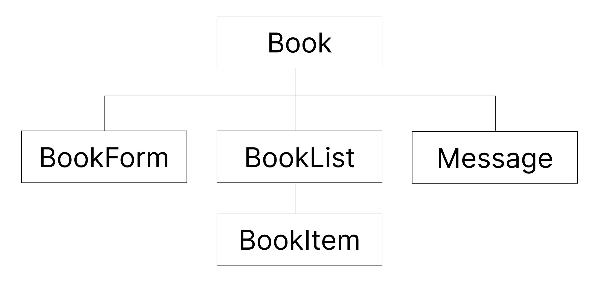

# 도서관리 프로그램

도서관에서 사용할 수 있는 도서관리 기능을 구현
<br>기존에 JavaScript로 만든 프로그램을 react + sass로 리팩토링

---
- Version1. JavaScript + css : https://hajinkimm.github.io/LibraryManagement/LibraryManagement_js/
- Version2. React + sass : https://hajinkimm.github.io/LibraryManagement/LibraryManagement_react/dist/
---
## 1. 구조
- 파일구조

    

---
## 2. 화면 출력
- 결과물

    

---
## 3. code 설명
- data 추가
    ```js
    const onSubmit=(e)=>{
        e.preventDefault()
        if(!title || !author || !bookcode) return
        if(isEdit){
            setIsEdit(false)
            setData(data.map(item=>item.id===user.id?user:item))
            setIsMsg(true)
            setMsg('도서가 수정 되었습니다.')
        }else{
            user.id = no.current++
            setData([...data, user])
            setIsMsg(true)
            setMsg('도서가 추가 되었습니다.')
        }
        setUser({title:'', author:'', bookcode:''})
        textRef.current.focus()
    }
    ```

- data 수정
    ```js
    const onEdit =(id)=>{
        setIsEdit(true)
        setUser(data.find(item=>item.id===id))
    }
    ```
- data 삭제
    ```js
    const onDel=(id)=>{
        setData(data.filter(item=>item.id !== id))
        setIsMsg(true)
        setMsg('도서가 삭제 되었습니다.')
    }
    ```
- localStorage를 이용하여 data저장
    ```js
    useEffect(()=>{
        localStorage.setItem('data',JSON.stringify(data))
    },[data])
    ```
- 추가, 삭제, 수정 시 메세지 출력
    ```js
    useEffect(()=>{
        const timer = setTimeout(()=>{
            setIsMsg(false)
        },1000)
        return()=>{
            clearTimeout(timer)
        }
    },[isMsg])
    ```
